# Getting Started

### Basic Actions

Shortcutslang tries to be familiar to read and write. To write an action, put the action name with no spaces and a list of arguments in order.

```coffeescript
ActionName "Action" "Arguments"
```

For example, the text action is named [Text](actions/text) and has one field, the text inside it.

```coffeescript
Text "This is my text"
```

<div><details>
<summary>Image</summary>
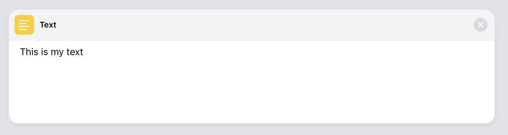
</details></div>

| Actions shown | [Text](actions/text) |

### Argument Labels

More complex actions have multiple fields

```coffeescript
GetFile "iCloud Drive" true false
```

<div><details>
<summary>Image</summary>
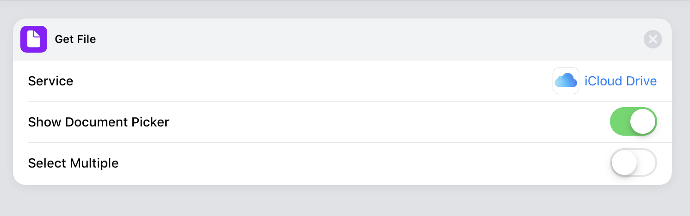
</details></div>

For these actions, you can put labels to know which field is which.

```coffeescript
GetFile service="iCloud Drive" showdocumentpicker=true selectmultiple=false
```

<div><details>
<summary>Image</summary>

</details></div>

| Actions shown | [GetFile](actions/getfile) |

### Block Actions

Other actions have blocks, like the [if action](actions/if) and [choose from menu action](actions/choosefrommenu)

```coffeescript
Text "hello"
If "Equals" "hello"
	ShowAlert title="Alert!" message="It equals hello"
Otherwise
	ShowAlert title="Alert!" message="It does not equal hello"
End If
```

<div><details>
<summary>Image</summary>
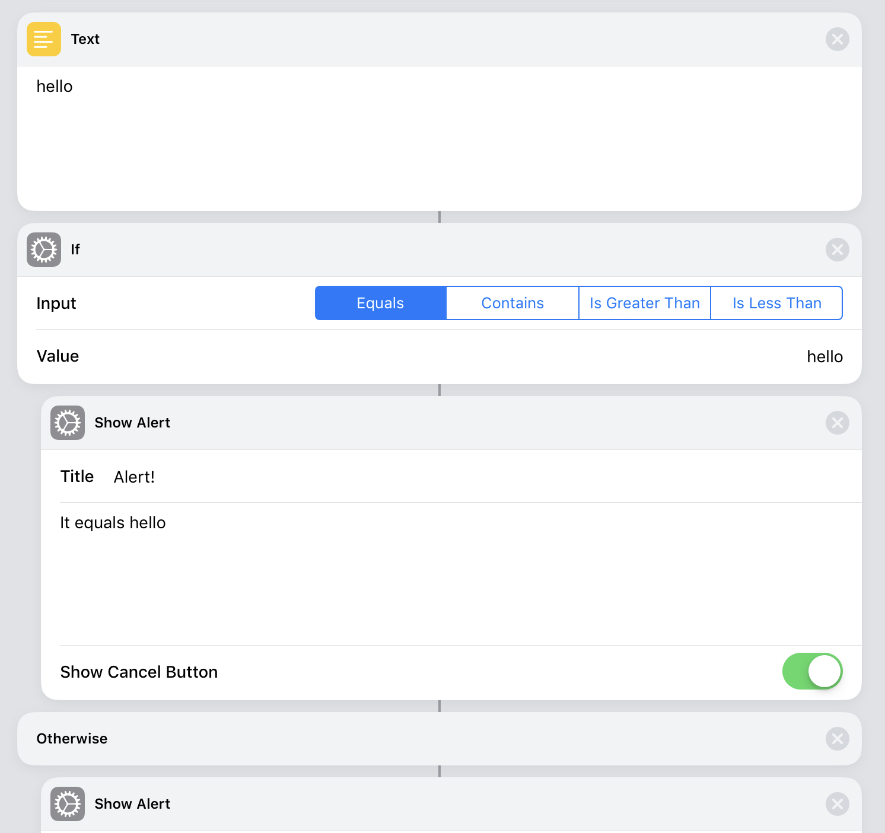
</details></div>

| Actions shown | [If](actions/if) | [ShowAlert](actions/showalert) | [Text](actions/text) |

### Variables

Variables are marked with type`:`varname. For example, a named variable called `Input` would be `v:Input`. There are 3 variable types, `v` for named variable, `mv` for magic variable, and `s` for special variables. To use a variable with spaces in the name, surround the name with quotes like `v:"Repeat Index"`

#### Using Variables

Variables can be used directly as a field value to an action or they can be put within strings or barlists (more info below).

```coffeescript
Text mv:MyMagicVariable
Text "Backslash parenthesis are used to put a variable inside text, like \(v:ThisVariable)."
```

<div><details>
<summary>Image</summary>
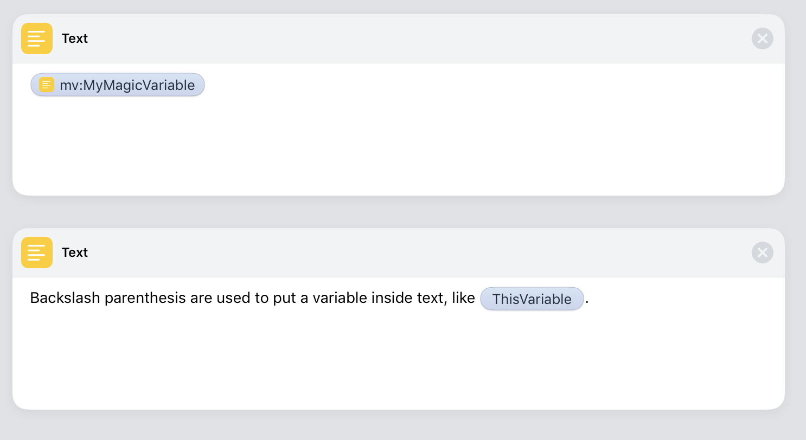
</details></div>

```javascript
Text
| The same is used for \(v:Variables) in barlists.
```

<div><details>
<summary>Image</summary>
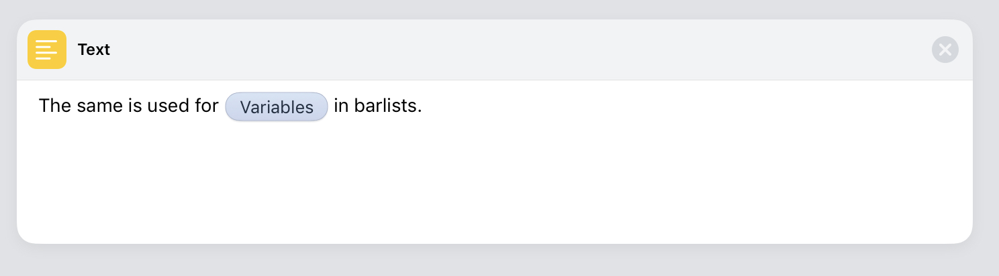
</details></div>

| Actions shown | [Text](actions/text) |

#### Setting Variables

Named variables are set just like how they are in shortcuts, using the [SetVariable](actions/setvariable) action. For example,

```coffeescript
Text "My text"
SetVariable "MyVariable"

# now you can use it
ShowResult "My text is \(v:MyVariable)"
```

<div><details>
<summary>Image</summary>
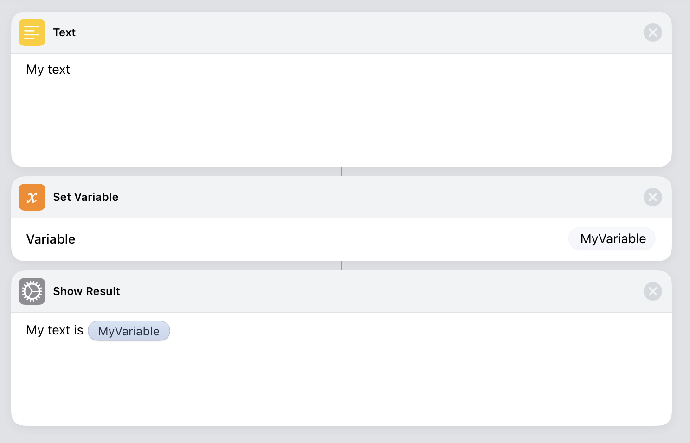
</details></div>

Magic variables are magical and don't require an action to set. Instead you use the `->` arrow set syntax to say that the action is magical.

```coffeescript
Text "My text" -> mv:Magic

# now you can use it
ShowResult "Magic! \(mv:Magic)"
```

<div><details>
<summary>Image</summary>
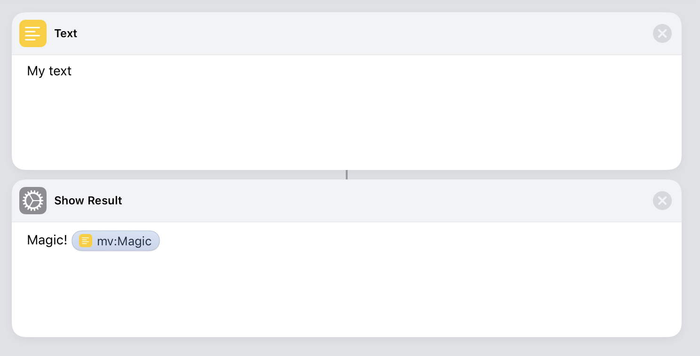
</details></div>

You cannot set special variables, they are special.

| Actions shown | [Text](actions/text) | [ShowResult](actions/showresult) |

#### ScPL Comments

ScPL comments can be put in your code like shortcuts comments but they do not output any actions.

```
# this is a comment
// this is also a comment
-- this is also a comment
```

<div><details>
<summary>Image</summary>
This shortcut has no actions
</details></div>

## Field Types

Shortcuts has many different field types, for each field type there are many ways you can write them in shortcutslang

### Text Field

Many actions have text fields of different sizes. The [Text](actions/text) action has a multiline text field, and the [Save file](actions/savefile) action has a single line text field to enter a destination path.

Text fields can be used with strings and multiline text fields can also be made with barlists

```javascript
Text "This is a text field with a string"

Text
| This is a multiline text field using a barlist.
| This is the second line
| This is a variable: \(v:MyVariable)
```

<div><details>
<summary>Image</summary>
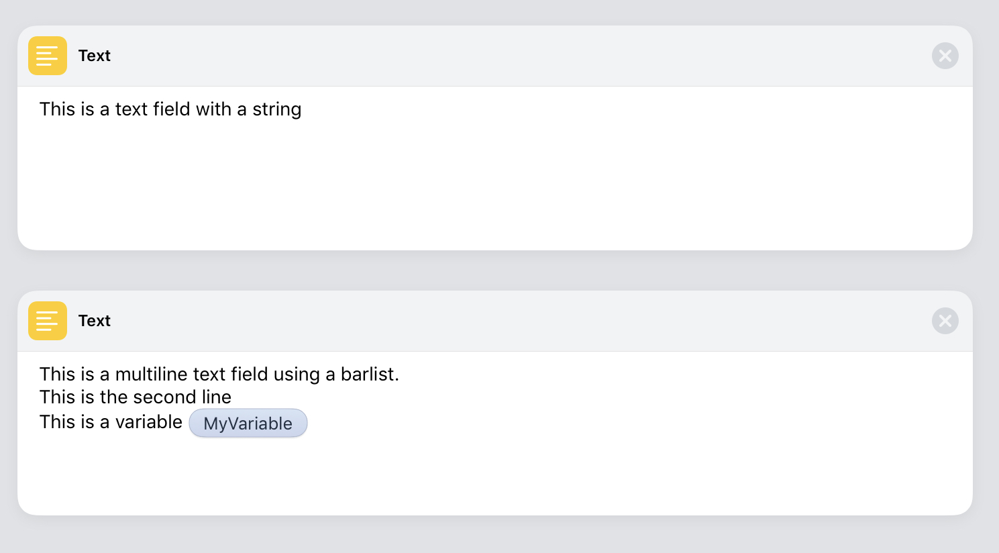
</details></div>


Some text fields do not allow variables, such as the [Comment](actions/comment) action.

```javascript
Comment
| This text field does not allow variables
```

<div><details>
<summary>Image</summary>
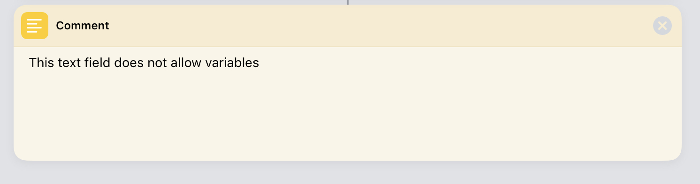
</details></div>

```coffeescript
Comment
| \(v:Variable) # Not Allowed
```

<div><details>
<summary>Image</summary>
This shortcut fails to convert
</details></div>

| Actions shown | [Text](actions/text) | [Comment](actions/comment) |

### Enum (Select) Field

An Enum Field has a list of options to choose from, such as the Condition field in [if](actions/if) or the operator field in [calculate](actions/calculate).

```coffeescript
Calculate "+" 1
```

<div><details>
<summary>Image</summary>
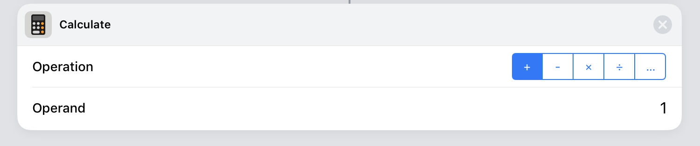
</details></div>

If you enter a value that is not allowed, shortcutslang will throw an error. Unlike action names, enum fields are case and space sensitive and must be exact.

Some enum fields allow variables, and some do not.

```coffeescript
Calculate v:Operand 3
```

<div><details>
<summary>Image</summary>
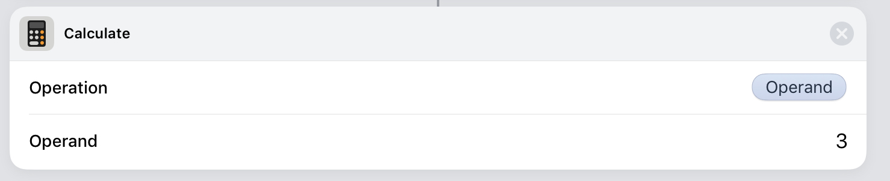
</details></div>

| Actions shown | [Calculate](actions/calculate) |

If an enum field does not allow variables, it will error when you try to use a variable.

Enum fields cannot have mixed text and variables, so `"\(v:Not) Equals"` is never allowed.

### Number Field

Number fields accept a number.

```coffeescript
Number 16
Number 29.5
Number -924
Number .8
Number -.2
```

<div><details>
<summary>Image</summary>
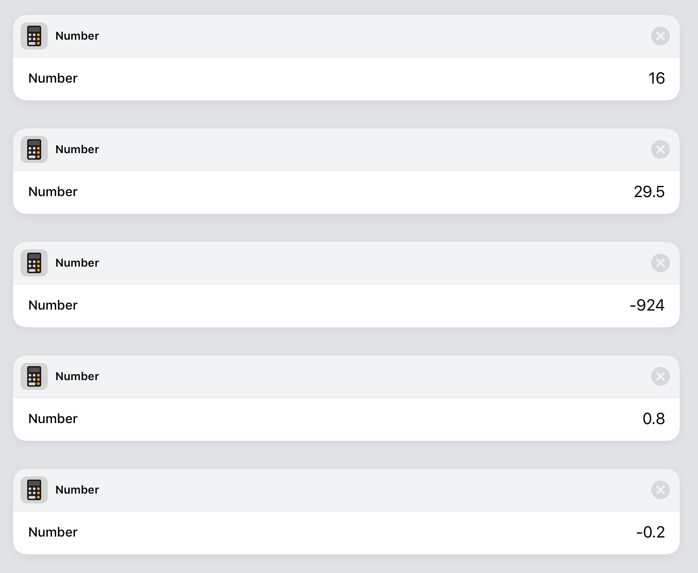
</details></div>

Similar to Enum fields, Number fields cannot have mixed text and variables.

```coffeescript
Number v:MyVariable
```

<div><details>
<summary>Image</summary>
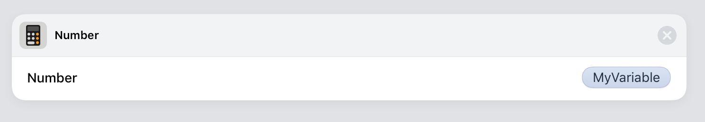
</details></div>

```coffeescript
Number "-\(v:MyVariable)" # Not Allowed
```

<div><details>
<summary>Image</summary>
This shortcut fails to convert
</details></div>

| Actions shown | [Number](actions/number) |

### Stepper Number Fields

Stepper number fields are like number fields but can only have positive integer numbers (no decimals)

```coffeescript
Repeat 5
  ShowResult "Hi"
End Repeat
```

<div><details>
<summary>Image</summary>
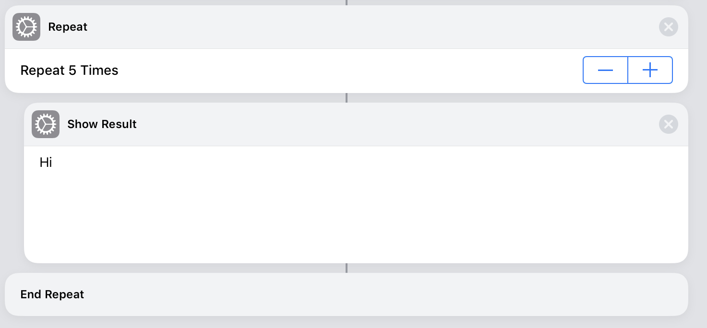
</details></div>

```coffeescript
Repeat 5.5 # Not allowed
  ShowResult "Hi"
End Repeat
```

<div><details>
<summary>Image</summary>
This shortcut fails to convert
</details></div>

| Actions shown | [Repeat](actions/repeat) |

### Slider Number Fields

Slider number fields are like number fields but can only have numbers from 0 to 1

```coffeescript
SetBrightness 0.5
```

<div><details>
<summary>Image</summary>
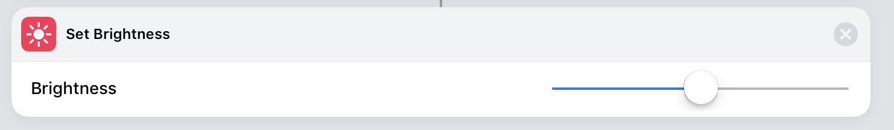
</details></div>

```coffeescript
SetBrightness 1.1 # Not Allowed
```

<div><details>
<summary>Image</summary>
This shortcut fails to convert
</details></div>

| Actions shown | [SetBrightness](actions/setbrightness) |

### Variable Picker Fields

Variable picker fields can have a variable.

```coffeescript
GetVariable v:MyVariable
```

<div><details>
<summary>Image</summary>

</details></div>

```coffeescript
GetVariable "MyVariable" # Not Allowed
```

<div><details>
<summary>Image</summary>
This shortcut fails to convert
</details></div>

| Actions shown | [getvariable](actions/getvariable) |

###  Switch (or Expanding or Boolean) Fields

Switch fields can have a true or false value. True is on and false is off.

```coffeescript
SetWifi true
SetAirplaneMode false
```

<div><details>
<summary>Image</summary>
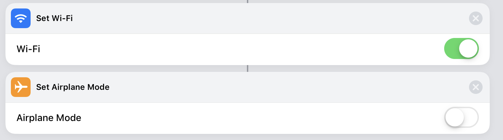
</details></div>

```coffeescript
SetWifi yes # Not Allowed, must be true or false
SetAirplaneMode no # Not Allowed, must be true or false
```

<div><details>
<summary>Image</summary>
This shortcut fails to convert
</details></div>

Some switch fields allow variables

```coffeescript
SetWifi v:Wifi
```

<div><details>
<summary>Image</summary>

</details></div>

| Actions shown | [SetWifi](actions/setwifi) | [List](actions/setairplanemode) |

### Dictionary Field

Dictionary fields are written like JSON

```coffeescript
Dictionary{
	"key": "value",
	"variable": v:myVariable,
	"list": ["item 1", "item 2"],
	"dictionary": {"key": "value"}
}
```

<div><details>
<summary>Image</summary>
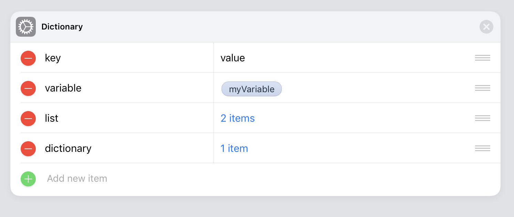
</details></div>

Quotes and commas are not required and `=` can be used instead of `:` if wanted

```coffeescript
Dictionary{
	key = value
	variable = v:myVariable
	list =  ["item 1", "item 2"]
	dictionary = {key = value}
}
```

<div><details>
<summary>Image</summary>

</details></div>

| Actions shown | [Dictionary](actions/dictionary) |

### List Field

Lists can be made using json-like `[]` syntax.

```coffeescript
ChooseFromMenu "Pick an item" ["item 1", "item 2"]
case 1
case 2
end menu
```

<div><details>
<summary>Image</summary>
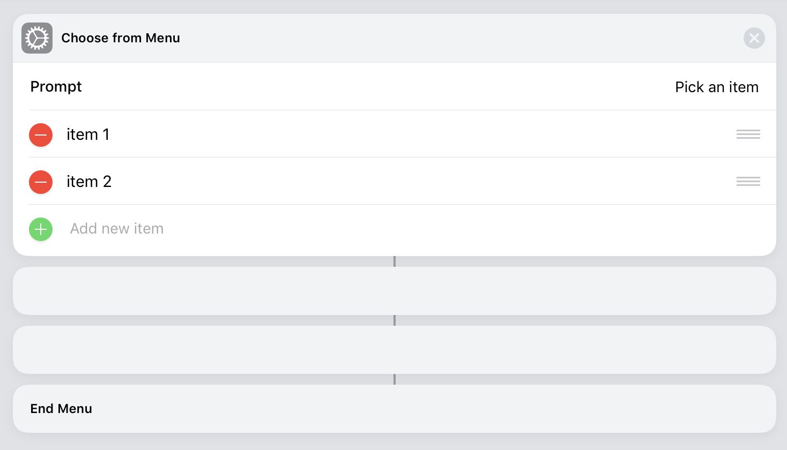

Even though the cases are blank the shortcut functions properly.
</details></div>

Similar to dictionaries, lists do not require commas and can span over multiple lines

```coffeescript
ChooseFromMenu "Pick an item" [
	"item 1"
	"item 2"
]
case First
case Second
end menu
```

<div><details>
<summary>Image</summary>


Even though the cases are blank the shortcut functions properly.
</details></div>

Lists can also be made using barlists.

```javascript
List
| My First Item
| My Second Item
```

<div><details>
<summary>Image</summary>
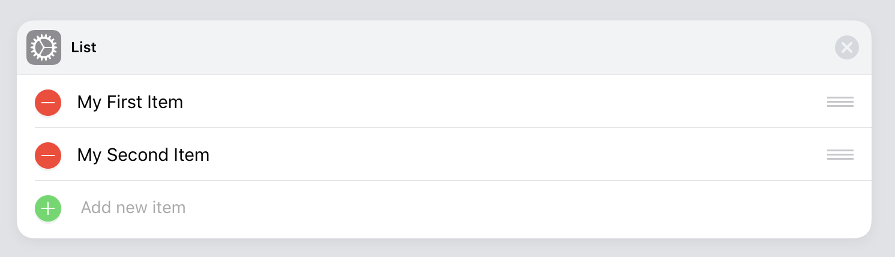
</details></div>

| Actions shown | [ChooseFromMenu](actions/choosefrommenu) | [List](actions/list) |

### Variable Field

(Different from Variable Picker Fields)

Variable fields is the field used in [SetVariable](actions/setvariable) to enter a variable name. They can be made using strings or v: variables.

```
SetVariable "MyNamedVariable"
SetVariable v:MyNamedVariable
```

<div><details>
<summary>Image</summary>
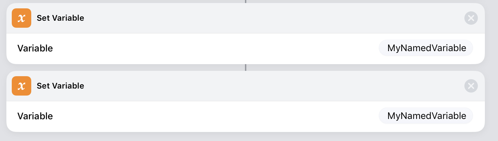
</details></div>

### Other Fields

There are other fields, most are very similar to similar fields like the Storage Service Picker is very similar to the Enum field.

## Advanced Features

Shortcutslang has some more advanced features to make working on large shortcuts easier

### Actions inside actions

You can put an action inside of a text field or any other field that accepts variable

```coffeescript
Text "My number is \(Number -2.5)"
```

<div><details>
<summary>Image</summary>
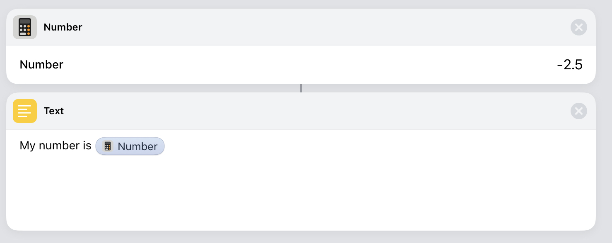
</details></div>

This code is equivalent to

```coffeescript
Number -2.5 -> mv:InsideParenthesis
Text "My number is \(mv:InsideParenthesis)"
```

<div><details>
<summary>Image</summary>
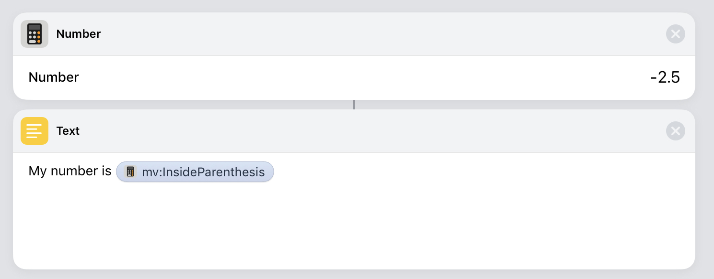
</details></div>

None of these magic variables actually get a name, they just directly reference the action.

You can even use actions inside other actions this without disrupting the action input

```coffeescript
Text "Hello"
If Equals (Text "Goodbye")
	ShowResult "If the action input was disrupted, this would run"
Otherwise
	QuickLook
End If
```

<div><details>
<summary>Image</summary>
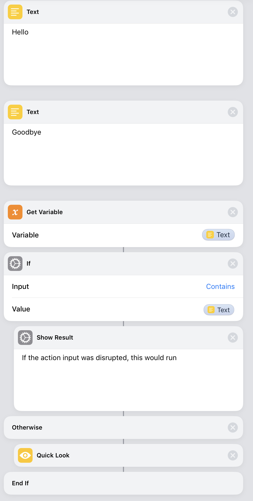
</details></div>

is equivalent to writing out

```coffeescript
Text "Hello" -> mv:OriginalInput
Text "Goodbye" -> mv:ArgumentValue
GetVariable mv:OriginalInput
If Equals mv:ArgumentValue
	ShowResult "If the action input was disrupted, this would run"
Otherwise
	QuickLook # Shows "Hello"
End If
```

<div><details>
<summary>Image</summary>

</details></div>

| Actions shown | [Text](actions/text) | [GetVariable](actions/getvariable) | [If](actions/if) | [QuickLook](actions/quicklook) | [Number](actions/number) |

### InputArg

Sometimes you want to disrupt the input, you can use an InputArg

```coffeescript
Text "Some text"
QuickLook ^(Text "Different text")
```

<div><details>
<summary>Image</summary>
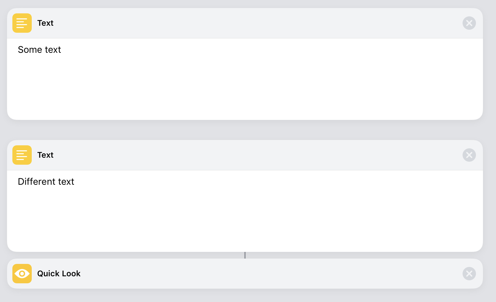
</details></div>

is the same as

```coffeescript
Text "Some text"
Text "Different text"
QuickLook
```

<div><details>
<summary>Image</summary>

</details></div>

| Actions shown |  [Text](actions/text) | [QuickLook](actions/quicklook) |

### Variable Aggrandizements

When you tap a variable in Shortcuts, a menu pops up containing different actions. Those are called Aggrandizements.

```coffeescript
GetVariable v:MyVariable{as:Dictionary,key:myKey}
GetVariable v:MyContact{as:Contact,get:Notes}
```

<div><details>
<summary>Image</summary>
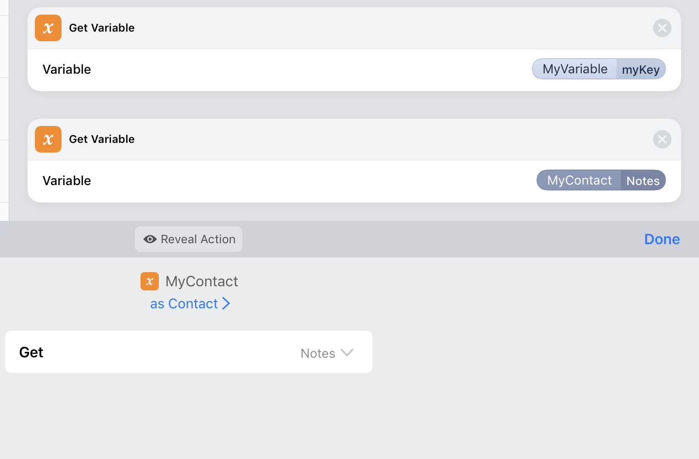
</details></div>

Currently, 3 aggrandizements are supported:

- as/coerce
- key/forKey
- get/getProperty (partial)

The key: aggrandizement is used very often in conjunction with the as: Dictionary aggrandizement. Instead of writing that out every time, there is a shortcut for it

```coffeescript
GetVariable v:MyDictionary:myKey
```

<div><details>
<summary>Image</summary>
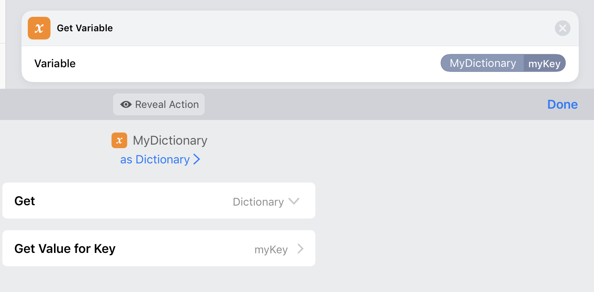
</details></div>

is the same as

```coffeescript
GetVariable v:MyDictionary{as:Dictionary,key:myKey}
```

<div><details>
<summary>Image</summary>

</details></div>

| Actions Shown | [GetVariable](actions/getvariable) |

### Setting Variables

`->` can be used to set more than just magic variables, it can also automatically make SetVariable actions.

```coffeescript
Text "My Text" -> v:MyNamedVariable
```

<div><details>
<summary>Image</summary>

</details></div>

is equivalent to writing

```coffeescript
Text "My Text"
SetVariable v:MyNamedVariable
```

<div><details>
<summary>Image</summary>

</details></div>

If you prefer, you can set variables before an action instead of after

```coffeescript
mv:WowMagic = Text "My Text"
```

<div><details>
<summary>Image</summary>
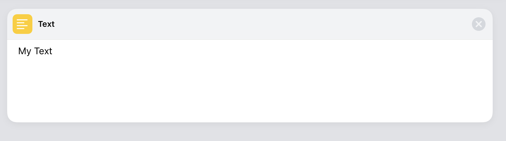
</details></div>

is exactly the same as using an arrow, except it's in the format `mv:variable = action`

```coffeescript
Text "My Text" -> mv:WowMagic
```

<div><details>
<summary>Image</summary>

</details></div>

 | Actions Shown | [Text](actions/text) |  | [GetVariable](actions/getvariable) |

### ArgLists

Actions can usually only take up one line of text, unless you use a barlist. If you have many different arguments, it can be helpful to have actions span multiple lines. You can use an arglist for this.

```coffeescript
getfile a{
  service="iCloud Drive"
  showdocumentpicker=false
  filepath="/myfile.txt"
  errorifnotfound=false
}
```

<div><details>
<summary>Image</summary>
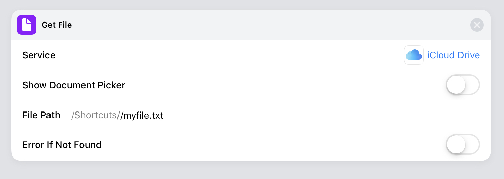
</details></div>

 | Actions shown | [GetFile](actions/getfile) |

### Special Variables

Shortcuts has 5 special variables, 2 of which seem to have no reason for existing.

- Ask When Run `s:AskWhenRun` (prompts the user to enter the field themselves)
- Shortcut Input `s:ShortcutInput` (the input to the shortcut)
- Action Input `s:ActionInput` (the input to the action)
- Current Date `s:CurrentDate` (the current date)
- Clipboard `s:Clipboard` (the contents of the clipboard)

<div><details>
<summary>Image</summary>
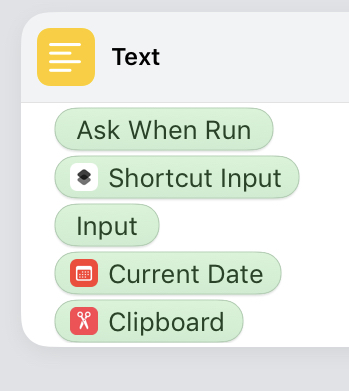
</details></div>

### Macros

Coming Soon!
